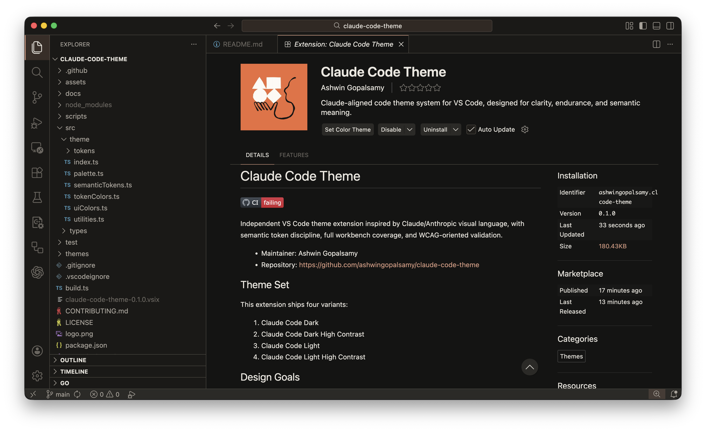
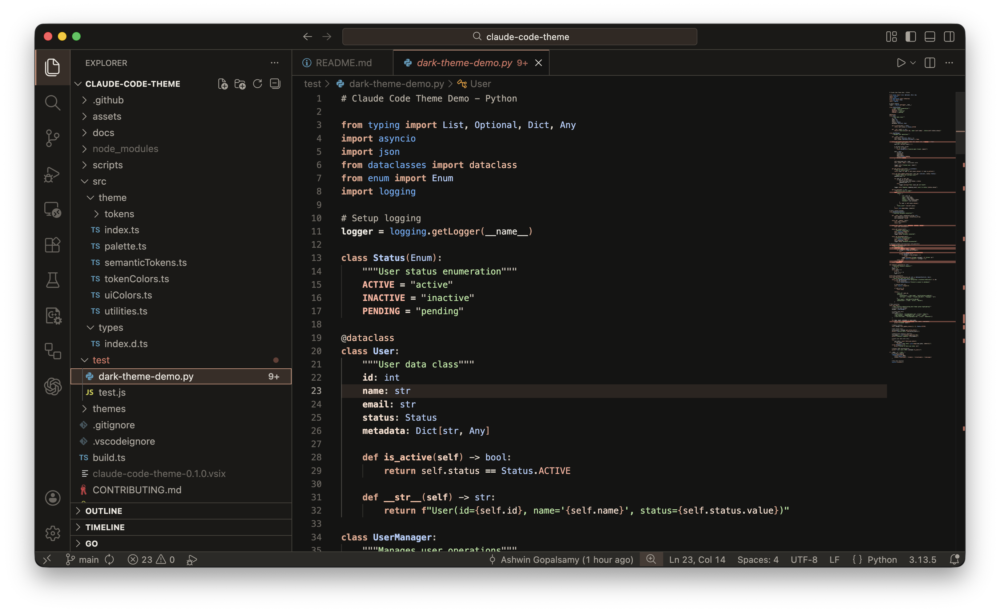
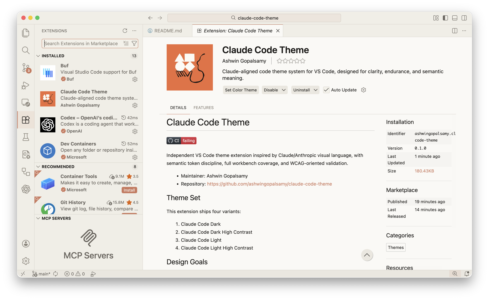
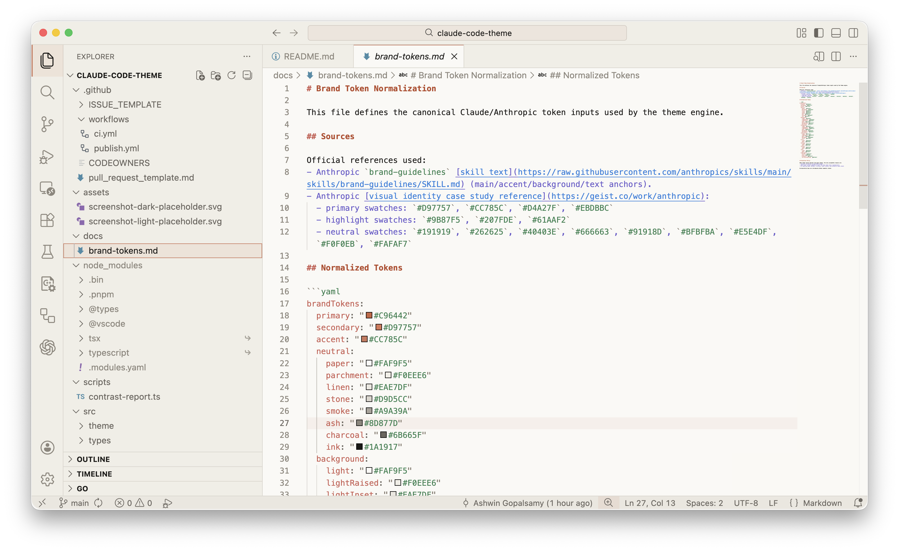
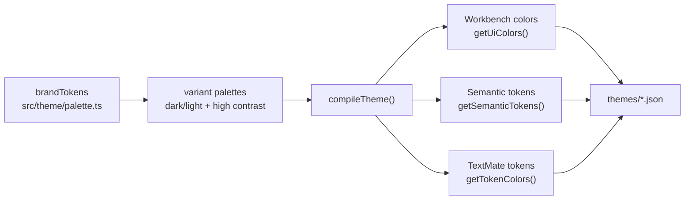

<p align="center">
  
</p>

<h1 align="center">Claude Code Theme</h1>

<p align="center">
  Warm Claude-inspired palettes for VS Code, built for <strong>long sessions</strong> and <strong>high signal syntax</strong>.
</p>

<p align="center">
  <a href="https://github.com/ashwingopalsamy/claude-code-theme/actions/workflows/ci.yml"></a>
  <a href="https://marketplace.visualstudio.com/items?itemName=ashwingopalsamy.claude-code-theme"></a>
  <a href="https://marketplace.visualstudio.com/items?itemName=ashwingopalsamy.claude-code-theme"></a>
</p>

```txt
4 theme variants • 243 workbench colors each • 81 TextMate rules • 37 semantic token rules
```

> [!TIP]
> Install in one line: `code --install-extension ashwingopalsamy.claude-code-theme`

## A Visual Tour

| Claude Code Dark | Claude Code Dark High Contrast |
| --- | --- |
|  |  |
| Claude Code Light | Claude Code Light High Contrast |
|  |  |

## Pick Your Cockpit

| Variant | Character | Best fit |
| --- | --- | --- |
| `Claude Code Dark` | Balanced warm dark | Daily coding + mixed workloads |
| `Claude Code Dark High Contrast` | Crisp high separation dark | Dense files, low-light focus |
| `Claude Code Light` | Soft paper-like light | Daytime editing without glare |
| `Claude Code Light High Contrast` | Clear, punchy light | Bright rooms + accessibility-first setup |

Activate any variant in `Preferences: Color Theme`.

## What Is Actually Tuned

This is not just a palette swap. The build compiles:

- full workbench theming (tabs, sidebar, panels, status bar, notifications, terminal, git decorations, minimap)
- semantic token rules for declarations, readonly/static modifiers, decorators, default libraries, and more

TextMate scope packs include:

- `JS/TS + JSX/TSX`
- `Go`
- `Python`
- `Java`
- `Rust`
- `HTML/CSS`
- `JSON/YAML`
- `Markdown`
- `SQL`

## Engine Map



## Contrast Snapshot

Local run from `pnpm contrast` on **February 10, 2026**:

| Variant | Editor | Comment | Keyword | Function | String | Number |
| --- | ---: | ---: | ---: | ---: | ---: | ---: |
| Claude Code Dark | 14.92 | 8.51 | 8.70 | 11.79 | 12.98 | 13.59 |
| Claude Code Dark High Contrast | 16.98 | 11.49 | 10.87 | 13.55 | 14.95 | 15.17 |
| Claude Code Light | 16.68 | 5.45 | 4.92 | 5.07 | 4.69 | 4.59 |
| Claude Code Light High Contrast | 16.61 | 5.34 | 5.35 | 4.73 | 4.88 | 5.08 |

<details>
<summary><strong>Quality gates in CI</strong></summary>

- `pnpm build` (generates `themes/*.json`)
- `pnpm compile` (TypeScript no-emit check)
- `pnpm contrast` (WCAG-oriented contrast checks)
- `pnpm package` (VSIX build)

CI workflow: `.github/workflows/ci.yml`  
Publish workflow: `.github/workflows/publish.yml`

</details>

## Install + Verify

<details open>
<summary><strong>Marketplace (recommended)</strong></summary>

1. Open Extensions: <kbd>Ctrl/Cmd</kbd> + <kbd>Shift</kbd> + <kbd>X</kbd>
2. Search `Claude Code Theme`
3. Install publisher `ashwingopalsamy`
4. Run `Preferences: Color Theme`
5. Select a `Claude Code ...` variant

</details>

<details>
<summary><strong>CLI</strong></summary>

```bash
code --install-extension ashwingopalsamy.claude-code-theme
```

</details>

## Dev Loop

```bash
pnpm install --frozen-lockfile
pnpm check
pnpm package
```

## Design Notes

Brand token normalization lives in `docs/brand-tokens.md`.[^brand]

[^brand]: References include Anthropic brand-guidelines skill text and the Anthropic identity case study (`docs/brand-tokens.md` has source links).

> [!IMPORTANT]
> This project is independent and is not affiliated with Anthropic.

## Project Info

- Maintainer: [Ashwin Gopalsamy](https://linkedin.com/in/ashwingopalsamy)
- Repository: [ashwingopalsamy/claude-code-theme](https://github.com/ashwingopalsamy/claude-code-theme)
- Marketplace: [Claude Code Theme](https://marketplace.visualstudio.com/items?itemName=ashwingopalsamy.claude-code-theme)
- Contributing: `CONTRIBUTING.md`
- Security: `SECURITY.md`
- Support: `SUPPORT.md`
- License: `MIT`
